# Teen Chef's Delight: "Doce da Casa"

## Ingredients:

* 4 eggs
* 400 ml of creamy cream
* 20 "bolacha maria"
* 4 table spoons of sugar

## Directions

### Separate the Eggs:
For each egg, delicately separate the yolk from the white. Place yolks in a pan and whites in a bowl.

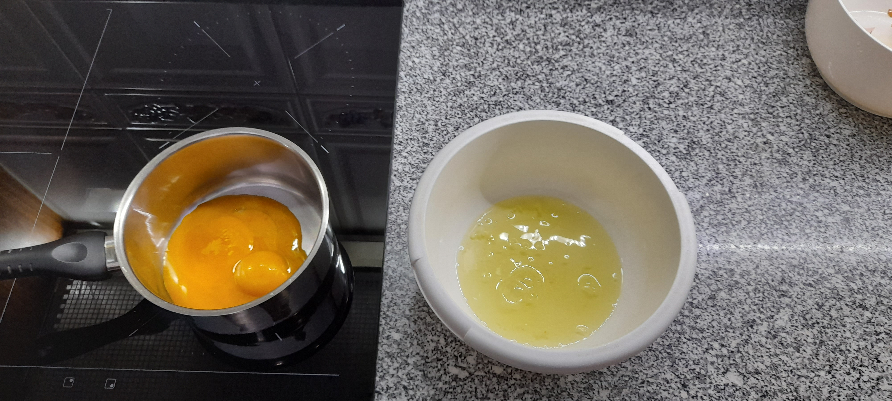

### Sweeten the Yolks:
Add 1 tablespoon of sugar and 1 tablespoon of water for each egg into the pan.

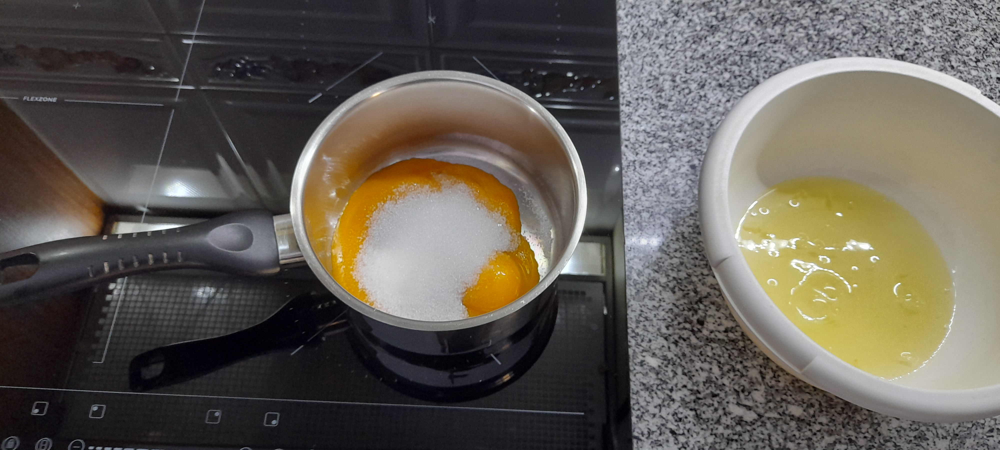
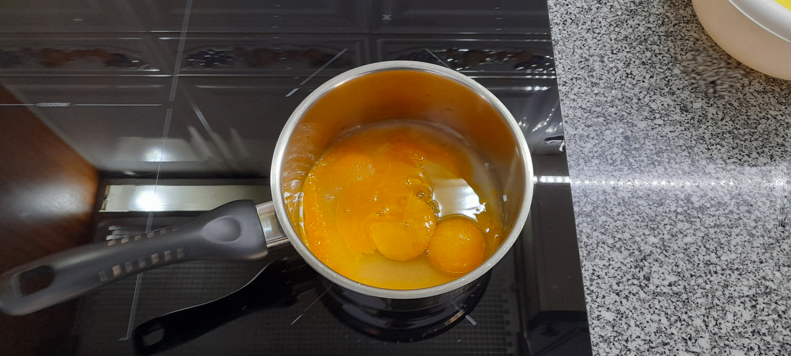

### Create Yolk Cream:
Stir the pan continuously while heating until it transforms into a luscious cream. Allow it to rest.

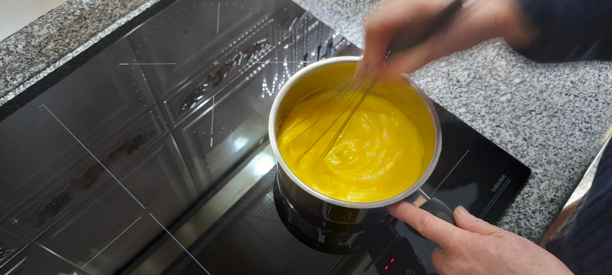
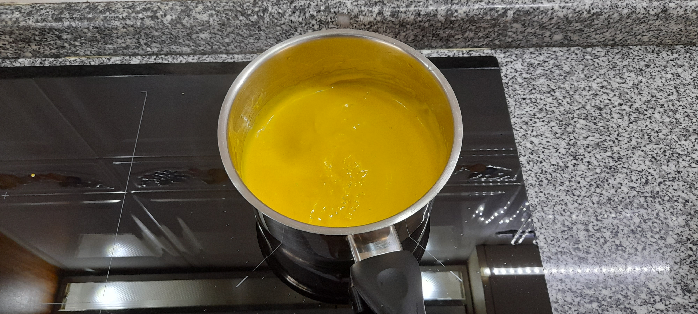

### Whip the Egg Whites:
While the yolk cream rests, beat the egg whites until they form soft peaks.

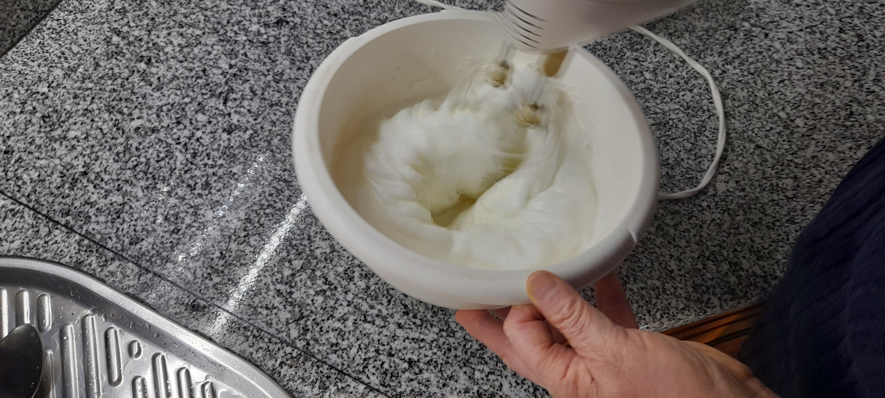
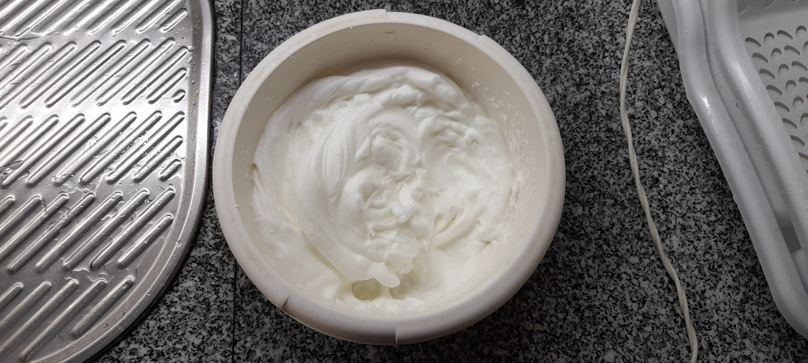

### Prepare "Bolacha Maria":
Place about 20 "bolacha maria" into a bowl and break them into small chunks.

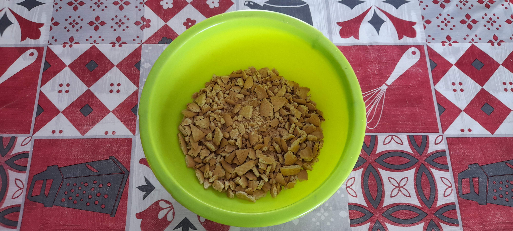

### Whip the Cream:
In another bowl, use an electric mixer to whip the creamy cream until it forms stiff peaks.

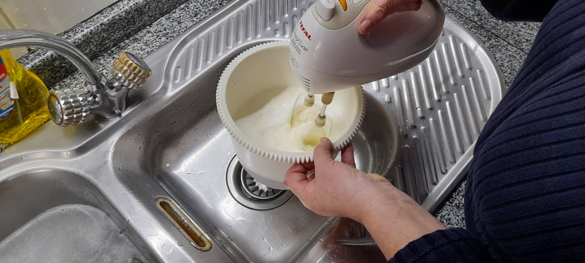

### Combine Egg Whites and Cream:
Gently mix the whipped egg whites with the creamy cream.

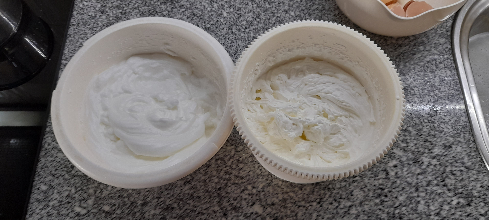
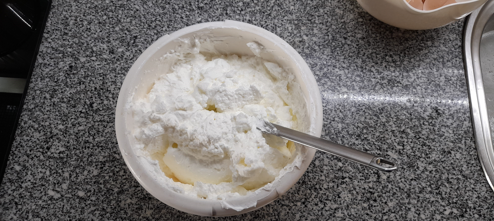

### Assemble the Layers:
In a separate bowl, create 4 layers alternating between the egg whites mixed with creamy cream and the broken "bolacha maria." Top it off with the yolk cream and a sprinkle of cookie powder.

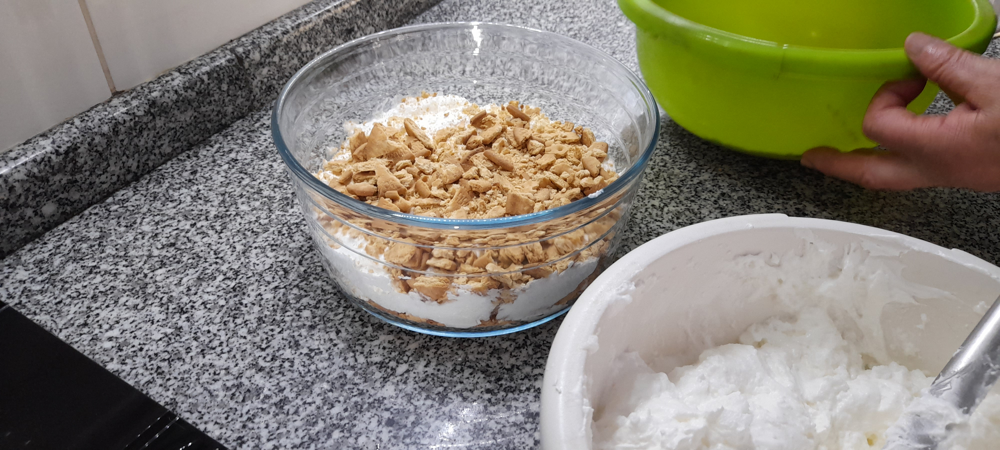
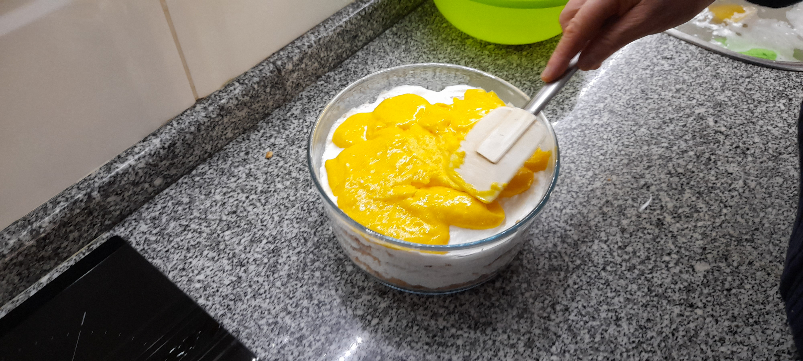
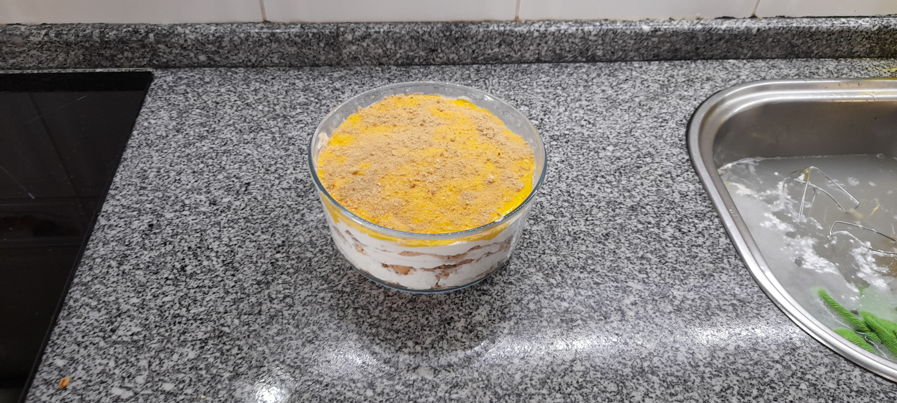

## LeftOvers

This delightful recipe leaves little behind.

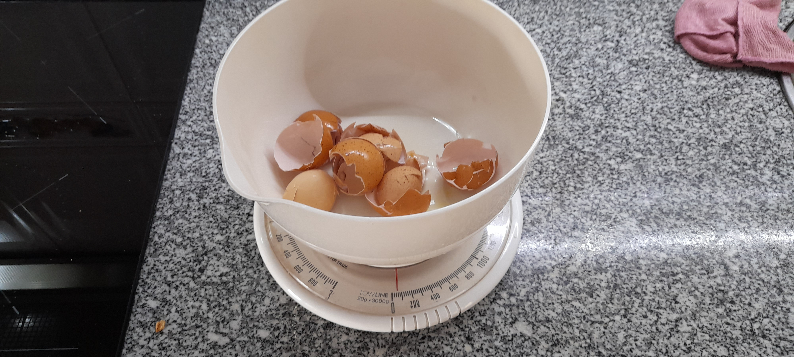
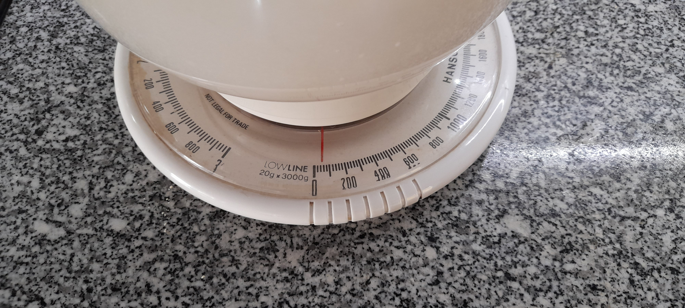

the total weight of leftovers is 70g.

The shells, along with remnants of the meal, were happily enjoyed by my chickens.

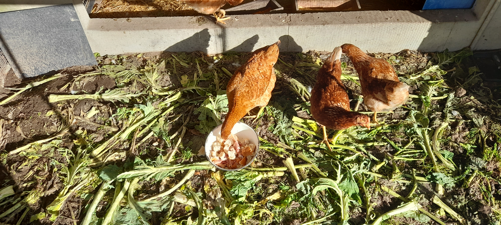